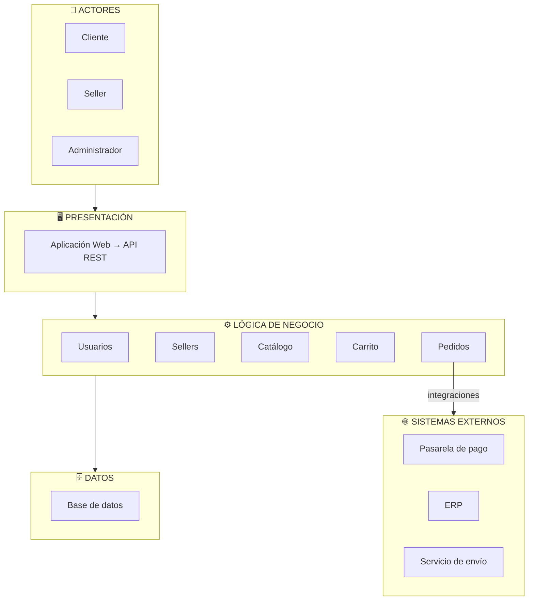

# 🏗️ Arquitectura Inicial del Sistema

## Descripción general
La arquitectura inicial se organiza en **tres capas principales**:

| Capa | Pregunta que responde |
|---|---|
| **Presentación** | ¿Cómo interactúa el usuario? |
| **Lógica de negocio** | ¿Qué hace el sistema? |
| **Datos** | ¿Dónde se almacena la información? |

Además, el módulo de **Pedidos** se integra con sistemas externos como la 
**pasarela de pago**, el **ERP** y el **servicio de envío**.
---

## Diagrama de arquitectura

---
---

## Diagrama de arquitectura

### Vista visual de la arquitectura

  

  <em>Arquitectura por capas · Integraciones externas desde Pedidos</em> 
  <a href="marketplace-mascotas-blanco.svg">Ver imagen completa</a> ·
  <a href="marketplace-mascotas.html">Versión interactiva</a>

La versión interactiva permite cambiar entre fondo claro y oscuro, ampliar y exportar el diagrama. Para utilizarla, descarga el archivo HTML y ábrelo en tu navegador.

## Justificación
La separación en capas permite aislar responsabilidades: la capa de 
presentación gestiona la interacción con el usuario, la lógica de negocio 
concentra las reglas del marketplace (catálogo, carrito, pedidos, sellers), 
y la capa de datos centraliza el almacenamiento. Esta organización responde 
directamente a los drivers de **mantenibilidad** (DA-relacionados) y facilita 
la integración con sistemas externos sin afectar el núcleo del sistema.
