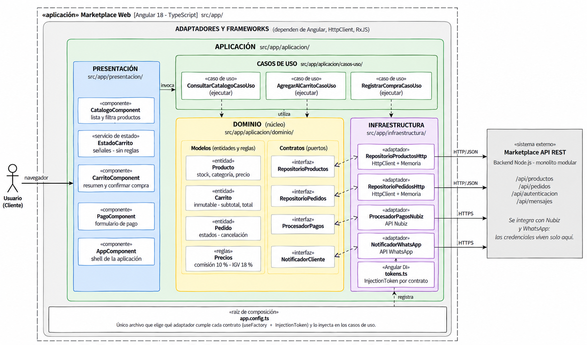

# 🧩 Patrones / Enfoque Arquitectónico

## Objetivo
Definir cómo se organizan las responsabilidades y las dependencias internas 
del sistema, aplicando el enfoque de Clean Architecture (Arquitectura Limpia).

---

## Enfoque seleccionado: Clean Architecture

| Elemento | Descripción aplicada al Marketplace |
|---|---|
| **Patrón / enfoque arquitectónico** | Clean Architecture (Arquitectura Limpia). |
| **Objetivo** | Separar responsabilidades y controlar las dependencias hacia el dominio. |
| **¿Qué problema resuelve?** | Evita el acoplamiento entre la interfaz Angular, las reglas del negocio y las tecnologías externas, como bases de datos, API y servicios de pago. |
| **Capas definidas** | Presentación, Aplicación, Dominio e Infraestructura. |
| **Beneficios** | • Facilita el mantenimiento y las pruebas unitarias. • Permite cambiar implementaciones técnicas sin modificar innecesariamente las reglas del negocio. • Mejora la organización y separación de responsabilidades del código. |

---

## Mapeo de capas (Clean Architecture → carpetas del proyecto)

| Capa de Clean Architecture | Carpeta | ¿Qué contiene? | Ejemplo en Marketplace |
|---|---|---|---|
| **Dominio** | `src/app/dominio/` | Entidades, objetos de valor y reglas de negocio puras. No depende de Angular, HttpClient ni RxJS. | `Producto`, `Carrito`, `Pedido`, `precios.ts` |
| **Aplicación** | `src/app/aplicacion/` | Casos de uso que orquestan el dominio. | `ConsultarCatalogoCasoUso`, `AgregarAlCarritoCasoUso`, `RegistrarCompraCasoUso` |
| **Presentación** | `src/app/presentacion/` | Componentes visuales y servicios de estado. | `CatalogoComponent`, `EstadoCarrito`, `CarritoComponent` |
| **Infraestructura** | `src/app/infraestructura/` | Adaptadores concretos que implementan los contratos del dominio (repositorios, pasarela de pago, notificaciones). | `RepositorioProductosHttp`, `ProcesadorPagosNiubiz`, `NotificadorWhatsApp` |

---

## Regla de dependencia (lo más importante de Clean Architecture)

1. El dominio no importa nada de las capas externas.
2. Los casos de uso solo conocen entidades y contratos (interfaces) del dominio.
3. Los adaptadores de infraestructura implementan esos contratos; son intercambiables.
4. Cambiar de tecnología = cambiar `app.config.ts`, no el dominio.

Esta regla asegura que las flechas de **dependencia de código** siempre apunten 
hacia el centro (Dominio), mientras que las **llamadas en tiempo de ejecución** 
pueden ir hacia afuera, gracias a la inversión de dependencias.

---

## Diagrama de arquitectura (Clean Architecture)

---

## Relación con los drivers arquitectónicos

| Driver | ¿Cómo lo resuelve Clean Architecture? |
|---|---|
| **DA07 - Mantenibilidad** | El dominio aislado permite modificar un módulo (ej. cambiar de pasarela de pago) sin tocar las reglas de negocio ni otros módulos. |
| **DA04 - Pasarela de pago** | El `ProcesadorPagos` es un contrato (interface); se puede intercambiar `ProcesadorPagosSimulado` por `ProcesadorPagosNiubiz` sin afectar los casos de uso. |
| **DA02 - Rendimiento** | Los adaptadores de infraestructura pueden incorporar caché sin que el dominio ni los casos de uso se enteren de esa decisión técnica. |